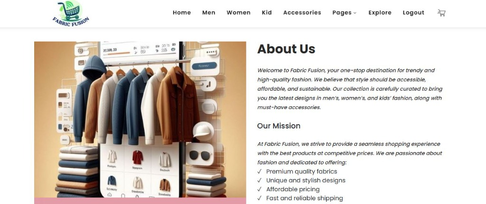

# 🧵 Fabric Fusion - E-Commerce Web Application

**Fabric Fusion** is an online e-commerce platform built with **PHP** and **MySQL**, designed to provide an intuitive shopping experience for clothing, apparel, and fashion accessories (Men, Women, Kids, Accessories). It features a dedicated customer storefront and a full-featured admin management panel.

---

## 🎨 UI Design & Preview

### 🏠 Home & Collection Showcase


### ℹ️ About Us & Brand Mission Page


### 🔑 User Registration Portal


---

## ✨ Features

### 🛍️ User Storefront
- **Home & Product Showcase**: Interactive landing page highlighting top collections and trending styles.
- **Categorized Shopping**: Browse by Men's wear, Women's fashion, Kids' apparel, and Fashion Accessories.
- **Detailed Product Pages**: High-resolution image galleries, specifications, sizing, price details, and descriptions.
- **Cart & Checkout**: Interactive shopping cart management with instant total calculation and checkout workflow.
- **Payment Processing**: Integrated order payment confirmation flow.
- **User Authentication**: Secure user registration and login portal.
- **Contact & About Us**: Inquiry form and detailed company overview.

### 🛡️ Admin Management Dashboard
- **Product Management**: Add, update, and manage inventory (products, artwork, photography, medium, types).
- **Artist & Photographer Profiles**: Dedicated management for designers and contributors.
- **Customer Inquiry Handling**: Manage incoming customer inquiries with status updates and response notes.
- **Content & Profile Settings**: Admin profile settings, password management, and contact page editing.

---

## 🛠️ Technology Stack

- **Backend Logic**: PHP 8.x / 7.x
- **Database**: MySQL / MariaDB (via mysqli)
- **Frontend UI**: HTML5, CSS3, JavaScript, jQuery, Bootstrap, FontAwesome
- **Local Server Environment**: XAMPP / WAMP / MAMP (Apache Web Server)

---

## 📂 Project Structure

```
fabric-fusion/
├── admin/                     # Admin Portal
│   ├── assets/                # Admin CSS, JS, fonts
│   ├── includes/              # DB connection, header, sidebar, footer
│   ├── add-art-product.php    # Add new product
│   ├── dashboard.php          # Admin overview & stats
│   ├── login.php              # Admin login page
│   └── ...                    # Product & category management pages
├── assets/                    # Shared assets (CSS, JS, Fonts)
├── images/                    # Product images & site graphics
├── loginsystem/               # Customer Auth system (Login/Register)
│   ├── config.php             # Customer database config
│   ├── login_form.php         # User login UI
│   └── register_form.php      # User registration UI
├── ui-design/                 # UI Design Mockups & Screenshots
│   ├── home_categories_ui.jpg # Home & Categories UI
│   ├── about_us_ui.jpg        # About Us Page UI
│   └── register_form_ui.jpg   # Registration Form UI
├── index.php                  # Main landing page
├── product.php                # Complete product catalog
├── men.php                    # Men's collection
├── women.php                  # Women's collection
├── kids.php                   # Kids' collection
├── accessories.php            # Fashion accessories catalog
├── single-product.php         # Single product details
├── addtocart.php              # Cart action handler
├── checkout.php               # Order checkout process
├── payment.php                # Payment processing page
├── contact.php                # Contact page & inquiry submission
├── fabric_fusion.sql          # Complete MySQL Database Schema
└── README.md                  # Project documentation
```

---

## 🚀 Setup & Installation Guide

### Prerequisites
- Install **[XAMPP](https://www.apachefriends.org/)** (or any Apache + MySQL PHP environment).

### Step-by-Step Instructions

1. **Clone the Repository**
   ```bash
   git clone https://github.com/krishap0308-dotcom/Fabric-Fusion.git
   ```

2. **Move Project to Local Web Root**
   Move the project directory to your local server directory:
   - For XAMPP: `C:\xampp\htdocs\fabric fusion`

3. **Import the Database**
   - Start **Apache** and **MySQL** modules in your XAMPP Control Panel.
   - Open your browser and go to `http://localhost/phpmyadmin/`.
   - Create a new database named `shopping` (or run `fabric_fusion.sql` directly).
   - Import `fabric_fusion.sql` included in the root directory.

4. **Database Configuration**
   - Ensure the database connection settings in `admin/includes/dbconnection.php` and `loginsystem/config.php` match your local environment credentials:
     ```php
     // Default credentials:
     $con = mysqli_connect("localhost", "root", "", "shopping");
     ```

5. **Run the Application**
   - Open your browser and navigate to:
     - **Customer Storefront**: `http://localhost/fabric fusion/index.php`
     - **Admin Portal**: `http://localhost/fabric fusion/admin/login.php`

---

## 🔑 Default Credentials

- **Admin Login**:
  - **Username**: `admin`
  - **Password**: `admin123`

---

## 📜 License

This project is open-source and available under the [MIT License](LICENSE).
